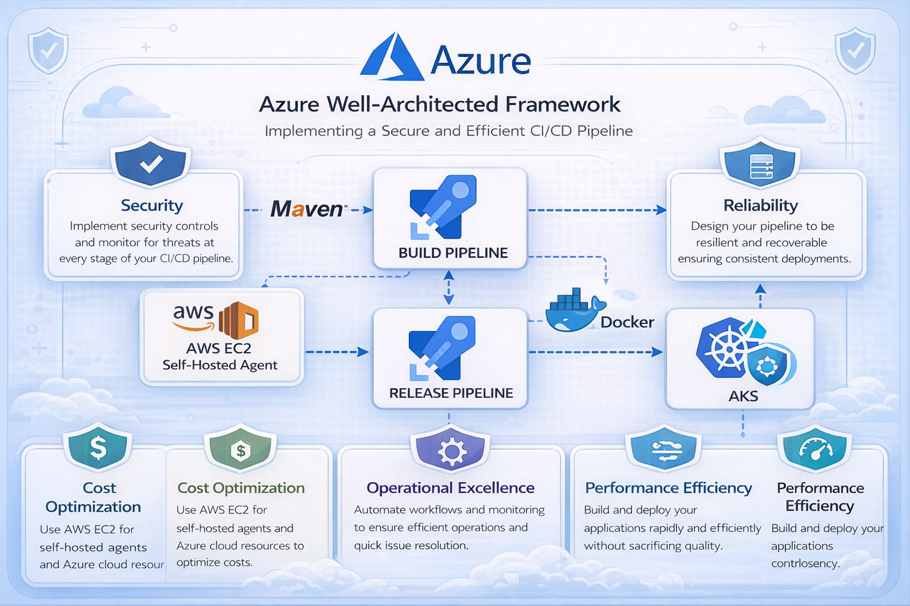

# 🚀 Building a Secure and High-Performance CI/CD Pipeline with an AWS EC2 Self-Hosted Agent for Azure Kubernetes Service Deployments using Azure DevOps

This project demonstrates the **design, deployment, and operation of a production-grade build and release application on Microsoft Azure**, aligned with the **Azure Well-Architected Framework**.

The focus is not just on *making it work*, but on **making deliberate architectural trade-offs** across security, reliability, cost, and operational excellence — the same principles used in large-scale, real-world systems.

--- 

## 🧩 Project Overview

> **In short:** this is not a demo app — it’s a **production-aligned cloud system** built to reflect how **senior engineers, engineering managers, and technical leaders** design, reason about, and operate infrastructure at scale.
---
## Architecture Overview 

This project was intentionally designed using the **Azure Well-Architected Framework (WAF)**  as the governing architectural model.
Each design decision across the CI/CD platform maps directly to one of the five pillars, ensuring enterprise-grade alignment between technical implementation and business outcomes.

---
## 🏗️ ☁️ Azure Well-Architected Framework Alignment and Architecture Overview

This architecture aligns with Microsoft’s **Azure Well-Architected Framework**, emphasizing intentional design decisions over default configurations.

| Pillar                       | Design Implementation in This Project                                    | Architectural Decisions Taken                                                                                                                                                                                                                                                                                                                       | Business Impact                                                                                                                                                                |
| ---------------------------- | ------------------------------------------------------------------------ | --------------------------------------------------------------------------------------------------------------------------------------------------------------------------------------------------------------------------------------------------------------------------------------------------------------------------------------------------- | ------------------------------------------------------------------------------------------------------------------------------------------------------------------------------ |
| 🔐 **Security**              | End-to-end secure supply chain from code commit to Kubernetes deployment | • Role-Based Access Control (RBAC) in Azure DevOps and AKS   • Private Azure Container Registry (ACR)   • Self-hosted AWS EC2 agent isolated from public workloads   • Controlled service connections between Azure DevOps and AKS   • Maven validation before artifact packaging   • Containerization to reduce host-level exposure | Reduces attack surface, enforces least-privilege access, and strengthens software supply chain security. Supports compliance readiness and enterprise governance requirements. |
| 🔁 **Reliability**           | Designed for consistent, repeatable, and recoverable deployments         | • Immutable Docker images   • Declarative Kubernetes manifests   • AKS self-healing pods   • Separation of Build and Release pipelines   • Versioned container tagging strategy                                                                                                                                                         | Minimizes production drift and deployment failures. Enables faster recovery and improves service uptime in production environments.                                            |
| ⚙ **Operational Excellence** | Automation-first design with clear separation of responsibilities        | • CI/CD automation through Azure Pipelines   • Maven-based quality gates   • Self-hosted agent for controlled execution   • Standardized deployment workflow   • Observability integration within AKS                                                                                                                                   | Reduces manual intervention, improves deployment velocity, and establishes repeatable operational processes aligned with enterprise DevOps maturity.                           |
| ⚡ **Performance Efficiency** | Optimized resource utilization through containerized architecture        | • Docker-based lightweight application packaging   • AKS orchestration and scaling capability   • Optimized Maven build lifecycle   • Controlled compute sizing on EC2 self-hosted agent                                                                                                                                                   | Ensures scalable workloads while maintaining cost-performance balance. Enables efficient compute utilization under varying traffic loads.                                      |
| 💰 **Cost Optimization**     | Conscious infrastructure and execution model decisions                   | • Self-hosted AWS EC2 agent instead of fully managed runners   • Containerization to reduce VM sprawl   • Right-sized AKS node pools   • No over-engineered DR or multi-region redundancy (by design)                                                                                                                                      | Balances enterprise capability with financial responsibility. Avoids unnecessary over-architecture while maintaining scalability and reliability.                              |
                          |
---
### 🛠️ Core Components

| Component                 | Business Purpose                         |
| ------------------------- | ---------------------------------------- |
| Azure Repos               | Secure source control & collaboration    |
| Azure DevOps Pipelines    | Automated CI/CD orchestration            |
| Maven                     | Code validation & build integrity        |
| AWS EC2 Self-Hosted Agent | Controlled execution & cost optimization |
| Azure Container Registry  | Secure image storage                     |
| Azure Kubernetes Service  | Scalable container orchestration         |
| Spring Boot Application   | Microservice workload example            |

---

## ⚠️ Challenges Faced

- Docker permission denied - Added `ubuntu` user to `docker` group.
- `exec format error` - AKS node was ARM64, Image was AMD64.
- Old Docker, no buildx - Upgraded Docker and installed buildx plugin.
- QEMU not installed - Installed `multiarch/qemu-user-static`.
- Base image AMD64 only - Switched from `lolhens/baseimage-openjre` to `eclipse-temurin`.
- Pipeline building wrong arch - Added QEMU + buildx bash tasks in Azure Classic Pipelines.
- Java version mismatch - Spring Boot 1.4.2 needs Java 8, switched from `eclipse-temurin:17-jre` to `eclipse-temurin:8-jre

Each challenge required systematic troubleshooting across multiple Azure services — reinforcing the importance of **systems thinking over isolated fixes**.

---

## ⚖️ Architectural Trade-offs & Non-Goals
| Decision                 | Benefit                      | Trade-Off                                 |
| ------------------------ | ---------------------------- | ----------------------------------------- |
| Self-hosted EC2 agent    | Cost control & customization | Operational overhead                      |
| AKS over VM deployment   | Scalability & resilience     | Increased complexity                      |
| Multi-cloud design       | Flexibility & portability    | Higher integration complexity             |
| Container-first strategy | Modern scalability model     | Kubernetes operational knowledge required |

---

## 🎯 Why This Project Matters

This project reflects how I approach engineering problems:

- ✅ Think in **systems**, not just services  
- ✅ Design for **failure, scale, and security from day one**  
- ✅ Balance **technical depth with business impact**  
- ✅ Treat infrastructure as a **product**, not a one-time setup  

It mirrors the kind of decision-making, ownership, and technical leadership expected in **senior engineering, engineering management, and platform roles**.
--- 
## 📜 Architectural Decision Records (ADRs)

| ADR ID      | Decision                                 | Context                                                                                       | Rationale (Why)                                                                                 | Trade-offs / Consequences                                                             |
| ----------- | ---------------------------------------- | --------------------------------------------------------------------------------------------- | ----------------------------------------------------------------------------------------------- | ------------------------------------------------------------------------------------- |
| **ADR-001** | VM Scale Sets instead of AKS             | Needed horizontal scalability and health-based recovery without excessive platform complexity | VMSS keeps operational focus on core infrastructure fundamentals and reduces cognitive overhead | Manual container lifecycle management, less orchestration flexibility than Kubernetes |
| **ADR-002** | Azure Application Gateway as L7 ingress  | Required TLS termination, health probes, and intelligent routing                              | Native Azure integration, production-grade Layer 7 routing, simpler than third-party ingress    | Higher cost than L4 LB, sensitive to probe/backend misconfiguration                   |
| **ADR-003** | Managed Identity + Azure Key Vault       | Secure handling of DB credentials and secrets                                                 | Eliminates hardcoded secrets, enforces least privilege, aligns with Zero Trust                  | Initial IAM setup complexity, steeper troubleshooting curve                           |
| **ADR-004** | Single-region, zone-resilient deployment | High availability required without global scale                                               | Realistic cost/resilience balance, mirrors many production systems                              | No cross-region DR, regional outage remains a risk                                    |
| **ADR-005** | Metrics-first observability              | Needed visibility with minimal tooling overhead                                               | Faster signal-to-noise ratio, easier operational ownership                                      | Limited request tracing, debugging deep flows is harder                               |

--- 

## 📌 Next Improvements

- Infrastructure as Code (Terraform)
- Azure Key Vault integration
- Blue/Green or Canary deployment strategy
- Horizontal Pod Autoscaler configuration
- Advanced observability (Prometheus + Grafana)
- Container vulnerability scanning
- GitOps model (ArgoCD)
- Azure Policy & compliance enforcement

---
## 📈 Lessons Learned

- Strong architecture reduces downstream operational risk
- CI validation is cheaper than production failures
- Kubernetes simplifies scaling but demands discipline
- Multi-cloud integration increases complexity — but also resilience
- Automation maturity directly impacts delivery velocity
- Governance must be built into the pipeline, not added later

---

## 🌍Business Value Delivered

This project demonstrates capability in:

- Enterprise architecture thinking
- Cloud-native DevOps strategy
- Multi-cloud design awareness
- Secure software supply chain implementation
- Cost-aware engineering
- Scalable container orchestration
- Governance-aligned platform design

It reflects the mindset required to lead cloud transformation initiatives at scale.

---
## 🏁 Final Reflection

This was not built as a simple deployment exercise.

- It was designed as an intentional architectural exercise to demonstrate:
- Strategic thinking
- Systems-level design capability
- Well-Architected alignment
- Cost-performance-security trade-off analysis
- Operational maturity

> *The outcome is a CI/CD platform that reflects real-world enterprise design patterns and cloud leadership readiness.*

Key takeaway:
> *This project reflects how I design systems in real organizations — start simple, document decisions, acknowledge trade-offs, and evolve architecture with intent rather than novelty.*

---
